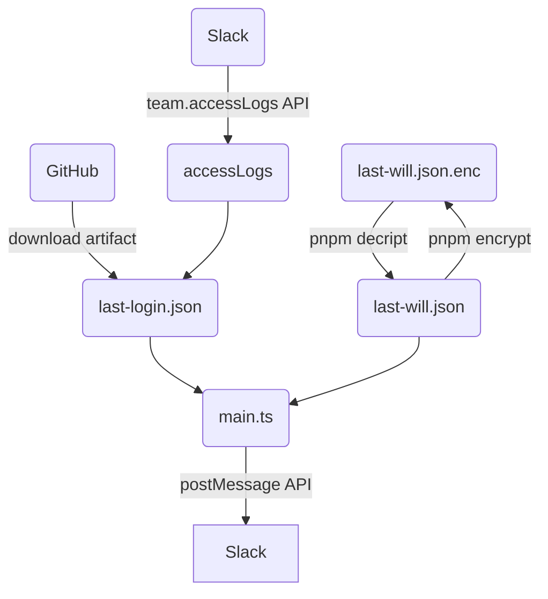

# Summary

Typescript that sends an arbitrary message to the left member depending on the
number of days that have passed since the last slack login date and time.

# Flow



# How to use

1. fork this repository
2. create `last-will.json`, and update your settings.

```sh
pnpm i
cp last-will.json.template last-will.json
vi last-will.json

pnpm encode

git add last-will.json.enc
git commit -m 'update last-will'
git push
```

3. setup the github secrets

- SLACK_BOT_TOKEN
  - require chat:write for the channel.
- SLACK_USER_TOKEN
  - require admin, for team.accessLogs API.
- SLACK_CHANNEL_NAME
  - slack channel name for message
- CRYPT_PASS
  - password for last-will.json.enc
- CRYPT_SALT
  - salt for last-will.json.enc

# last-will.json

```json
{
  "messages": [
    {
      "condition": {
        "type": "account",
        "account": {
          "userName": "hoge",
          "silentDays": 2
        }
      },
      "message": "Message sent on the day hoge has not logged in for 2 days."
    },
    {
      "condition": {
        "type": "date",
        "date": "2024-04-29"
      },
      "message": "Message sent on 2024-04-29."
    },
    {
      "condition": {
        "type": "dateAndAccount",
        "date": "2025-12-01",
        "account": {
          "userName": "ryo",
          "minSilentDays": 365
        }
      },
      "message": "Message sent if ryo has not logged in for 365 days or more on 2025-12-01."
    }
  ]
}
```
